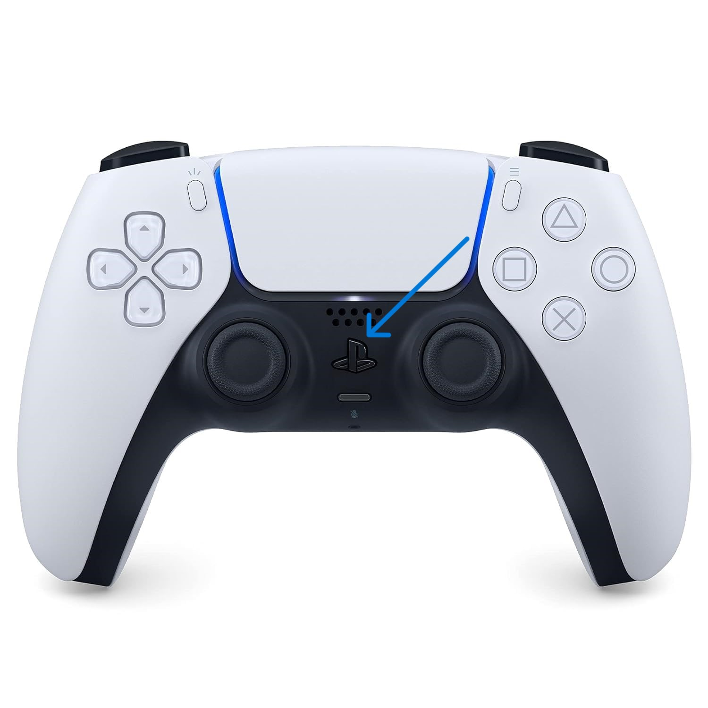

# Teleoperation (with optional sensor data remote visualization)
## Overview
1. Connect the powerbank and its dc barrel connector to the jetson 
2. Attach the body cover using the four standoffs.
3. Connect the remote computer to the jetson using RustDesk (or SSH):
	1. Press the Windows Key
	2. Search for RustDesk and open the app
	3. Double click on the desired gosling
4. Connect the VESC to the battery using the XT-90 connectors.
5. Turn on the DualSense (PS5) controller by tapping the PS button. The light should be solid (not blinking) blue to indicate connection 
6. To launch the F1/10 use either of the below commands but not both:
	1. Teleoperation only mode: `ros2 launch f1tenth_launch teleop.launch.py launch_vehicle:=True launch_sensors:=False launch_localization:=False vesc_poll_rate:=50.0`
    2. (optional) Teleoperation with sensing and remote visualization:
		1. Run teleop with sensing: `bash ros2_launch_scripts/f1tenth_launch_teleop_with_sensing.sh`
		2. Launch the image and pointcloud compression nodes (SSH terminal or RustDesk): `bash ~/ros2_launch_scripts/f1tenth_compressors.sh`
		3. Launch the Decompression nodes and visualization (On the Remote PC, i.e no SSH):
			1. Terminal 1: `bash ~/ros2_launch_scripts/f1tenth_decompressors.sh`
7. Drive the car around:
	1. Hold down the L1 button to arm the motors (Note: the car will not move if L1 is released)
	2. Move the left analog stick up and down to drive/reverse. (Note: move slowly otherwise the car will accelerate rapidly).
	3. Move the right analog stick left and right to steer the car