This document details the process of setting one (or more) of the F1/10 autonomous vehicle as well as summarizes the components involved. By the end, any user, even without prior experience should have a mid to high level understanding of the platform and how to use them.

# System Overview

<figure>
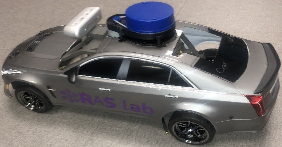
<figcaption>
: F1/10 Platform
</figcaption>
</figure>

The F1/10 platform is a scaled modular Ackermann vehicular robot with the sensors and actuators needed for autonomous vehicle research and experimentation in areas of perception, localization, and controls developed by the Autonomous Systems Group within RASLAB at the FAMU-FSU College of Engineering.

<figure>
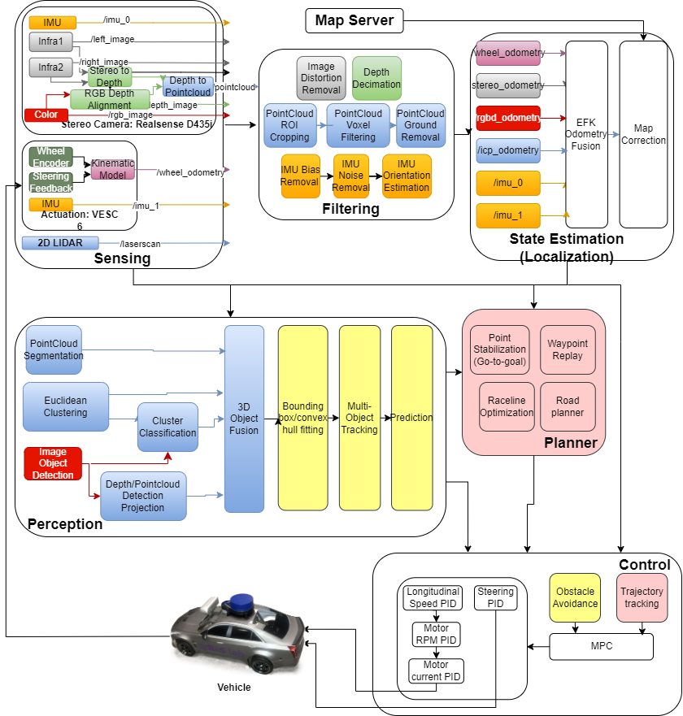
<figcaption>
: System Architecture
</figcaption>
</figure>

# Hardware Components (v1)

<table>
<colgroup>
<col style="width: 50%" />
<col style="width: 50%" />
</colgroup>
<thead>
<tr>
<th>
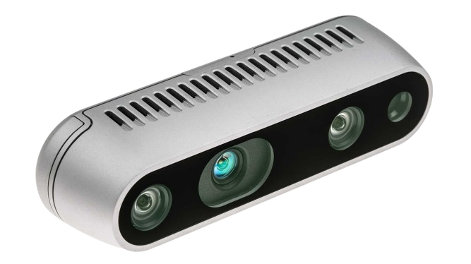

Figure : Intel Realsense D435i (Stereo Camera)
</th>
<th><ul>
<li>
1x RGB Visual Camera @ 30FPS
</li>
<li>
2x Infrared Cameras @ 30FPS
</li>
<li>
1x IMU @ 200Hz
</li>
<li>
Depth Image from Stereo (infrared cameras) @ 30FPS
</li>
<li>
Pointcloud from depth with optional color up to 4m @ 30FPS
</li>
</ul></th>
</tr>
</thead>
<tbody>
<tr>
<td>
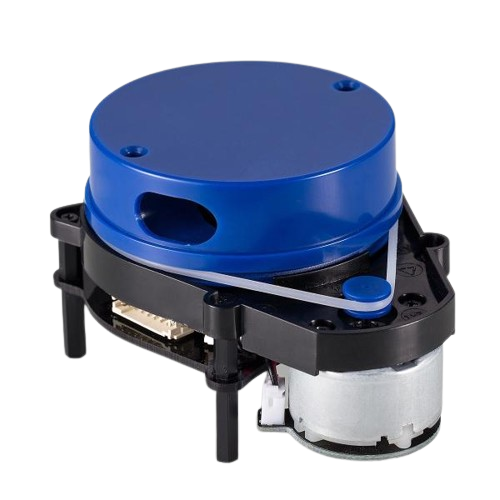

: YDLIDAR X4 (LaserScanner)
</td>
<td><ul>
<li>
2D Pointcloud up to 12m @ 8Hz
</li>
</ul></td>
</tr>
<tr>
<td>
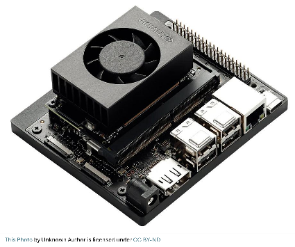

Figure 5: Nvidia Jetson Orin Nano (Embedded Computer)
</td>
<td><ul>
<li>
CPU: 6-core Arm® Cortex®-A78AE
</li>
<li>
GPU: NVIDIA Ampere architecture with 1024 CUDA cores and 32 tensor cores
</li>
<li>
RAM: 8GB 128-bit LPDDR5
</li>
<li>
Storage: 1TB NVMe SSD
</li>
<li>
Power consumption: 15W
</li>
</ul></td>
</tr>
<tr>
<td>
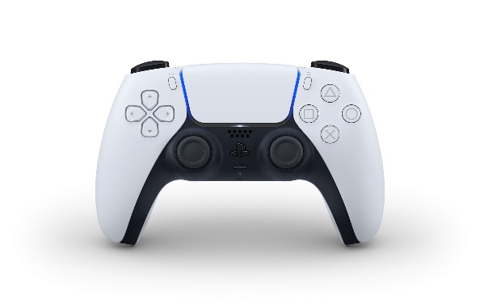

Figure : Playstation 5 DualSense Controller
</td>
<td><ul>
<li>
Bluetooth controller
</li>
</ul></td>
</tr>
</tbody>
</table>

<table>
<colgroup>
<col style="width: 54%" />
<col style="width: 45%" />
</colgroup>
<thead>
<tr>
<th>
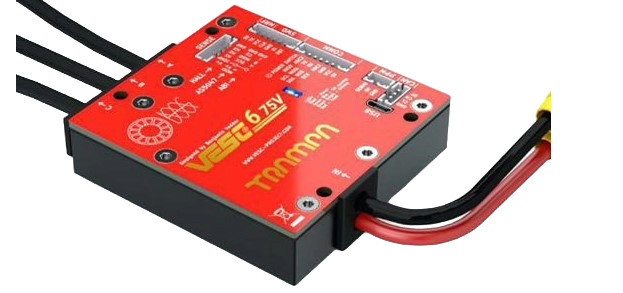

: VESC 6 Mk VI (Actuator)
</th>
<th><ul>
<li>
Brushless motor ESC
</li>
<li>
Voltage: 11.1v (3S LiPo battery)
</li>
<li>
Current: 80A continuous (120 A max)
</li>
<li>
1x IMU
</li>
<li>
Actuator feedback
</li>
</ul></th>
</tr>
</thead>
<tbody>
<tr>
<td>
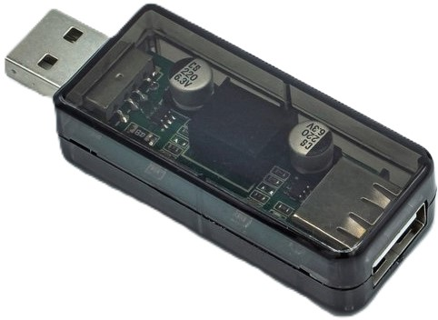

: USB Isolator
</td>
<td><ul>
<li>
Creates a separate, isolated ground
</li>
<li>
Breaks the ground loop caused by connecting two batteries with different grounds (LiPo and Li-ion) when connecting the VESC to the PC
</li>
</ul></td>
</tr>
<tr>
<td>
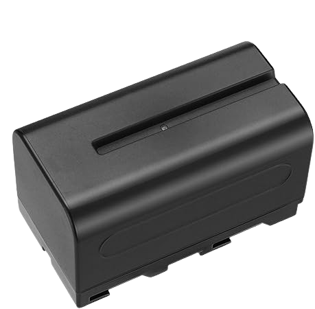

: NP-F750 Battery (Jetson + Sensors)
</td>
<td><ul>
<li>
Battery Type: Li-ion
</li>
<li>
Voltage: 7.2v (min), 7.7v (nominal), 8.4 (max)
</li>
<li>
Capacity: 5600mAh
</li>
<li>
Current (charge): 1A
</li>
</ul></td>
</tr>
<tr>
<td>

: NP-F Adapter
</td>
<td><ul>
<li>
Voltage: 7.4 v or 12.0v
</li>
<li>
Current (discharge): 2A
</li>
</ul></td>
</tr>
<tr>
<td>
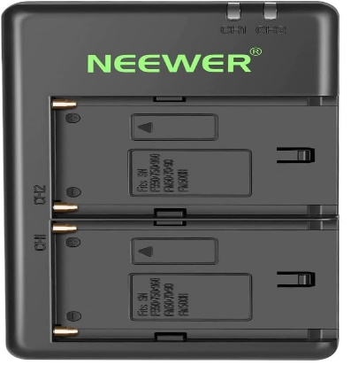

: NP-F Battery Charger
</td>
<td><ul>
<li>
Input Voltage: 5v
</li>
<li>
Output Voltage: 8.4v
</li>
<li>
Current (charge): 2A (1A per battery)
</li>
</ul></td>
</tr>
<tr>
<td>
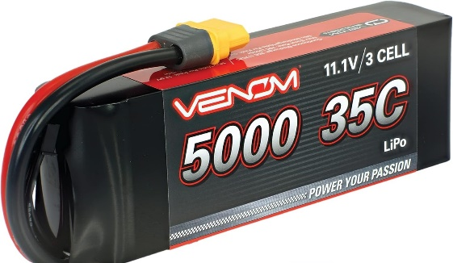

: Venom LiPo Battery (VESC)
</td>
<td><ul>
<li>
Battery Type: LiPo
</li>
<li>
Voltage (3S LiPo): 9.2v (min), 11.1v (nominal), 12.6v
</li>
<li>
Current (discharge): 175A continuous (350A max)
</li>
<li>
Current (charge): 5A
</li>
<li>
Capacity: 5000mAh
</li>
</ul></td>
</tr>
<tr>
<td>

: Traxxas EZ Peak Plus Dual Charger
</td>
<td><ul>
<li>
Voltage (output): 12v (for 3S LiPo)
</li>
</ul></td>
</tr>
<tr>
<td>
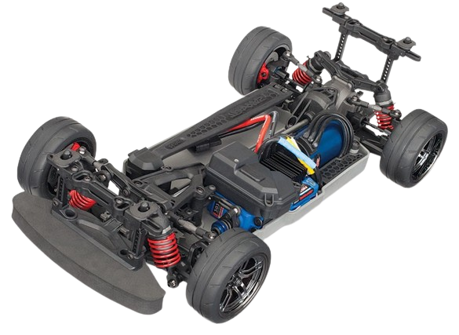

Figure 14: Traxxas 4 Tec 2.0 VXL Chassis
</td>
<td><ul>
<li>
Max speed: 70 MPH
</li>
<li>
Wheelbase: 0.256m
</li>
<li>
Wheel radius: 0.033m
</li>
<li>
Overall Drive Ratio: 6.87
</li>
</ul></td>
</tr>
<tr>
<td>

: 2019 Cadillac CTS-V
</td>
<td><ul>
<li>
Plastic body shell
</li>
</ul></td>
</tr>
<tr>
<td>
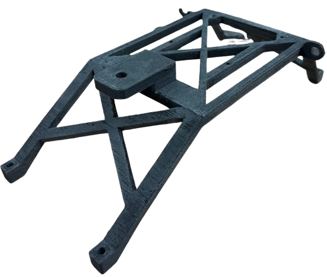

: Rollcage
</td>
<td><ul>
<li>
Made from Nylon-12
</li>
</ul></td>
</tr>
</tbody>
</table>

# Software Requirements:

- Operating system: Ubuntu 22.04 (Codename: Jammy Jellyfish)

- Python version: 3.10

- CUDA version: 12.2

- CuDNN version: 8.9.4.25

- TensorRT version: 8.6.2.3

- ROS Version: 2

- ROS Distro: Humble

- Packages:

  - C++ Drivers:

| **Package** | **Version/Branch** | **Link to Repository** |
|----|----|----|
| Librealsense SDK | v2.55.1 | [GitHub](https://github.com/IntelRealSense/librealsense) |
| YDLIDAR SDK | Master | [GitHub](https://github.com/YDLIDAR/LIDAR_SDK) |
| VESC Driver | 1952e79 | [GitHub](https://github.com/privvyledge/f1tenth_system) |

- Python packages:

| **Package** | **Version/Branch** | **Purpose** |
|----|----|----|
| Numpy | 1.21.4 | Array manipulation |
| Acados | 0.1 | Real-time Optimization |
| Casadi | 3.6.5 | Real-time Optimization |
| Do-MPC | 4.6.5 | Optimization Prototyping |
| OpenCV | 4.5.0 | Image Processing |
| Open3D | 0.18.0 | Pointcloud and RGB-D processing and perception |
| Torch | 2.3.0 | CPU/GPU Tensor manipulation |
| Ultralytics | 8.3.39 | Image-based object detection |

- ROS Packages

| **Package** | **Purpose** |
|----|----|
| Realsense ROS Wrapper | Publish realsense data as ROS messages. |
| YDLIDAR ROS Driver | Publish LaserScans as ROS messages |
| Image transport | Image compression/decompression |
| PointCloud Transport | PointCloud compression/decompression |
| Rviz2 | Visualization |
| Image pipeline | Image processing |
| IMU filters | IMU orientation estimation |
| Robot localization | Extended Kalman Filter based sensor fusion |
| F1tenth_launch | Launches all nodes with defaults for autonomous driving. |

# Hardware Connection Setup (Sensor Assembly)

| Step 1: Get the base plate. | 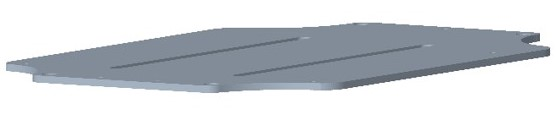 |
|----|----|
| Step 2: Mount the computer on the baseplate via the four screws on the outer edge with the DC jack and USB facing the rear of the car. | 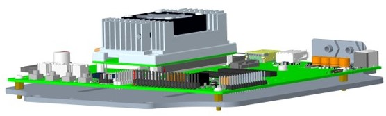 |
| Step 3: Mount the VESC upside down under the baseplate. | 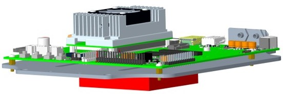 |
| Step 4: Attach the rollcage to the baseplate. | 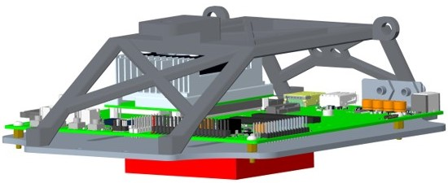 |
| Step 5: Mount the LIDAR to the top-center of the rollcage. | 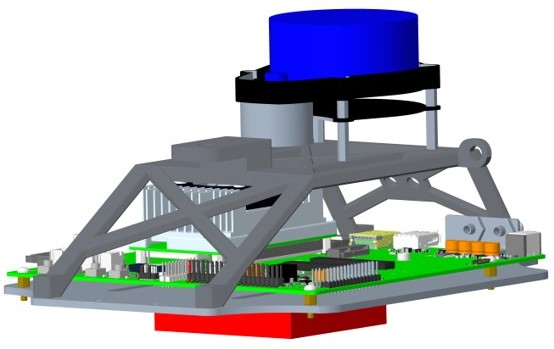 |
| Step 6: Mount the camera to the top-front of the rollcage. | 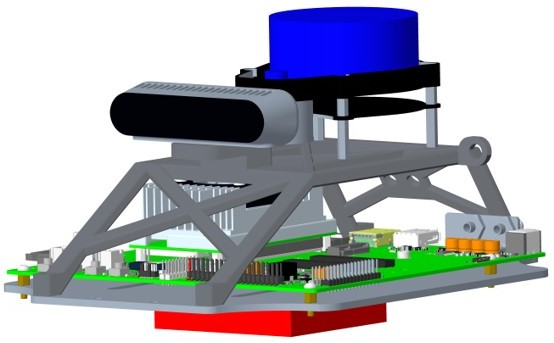 |
| Step 7: Screw in the NP-F battery adapter to the inclined rear part of the rollcage. Then slide in the battery to the adapter. | 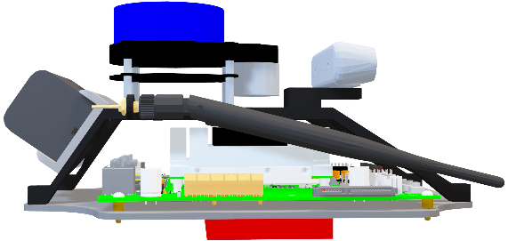 |

The resulting sensor assembly should be like the photos below:

<table>
<colgroup>
<col style="width: 47%" />
<col style="width: 52%" />
</colgroup>
<thead>
<tr>
<th>
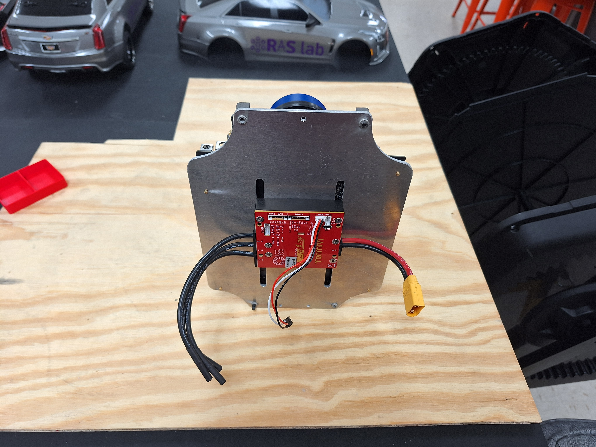

: VESC Assembly
</th>
<th>

: Sensor and PC Assembly
</th>
</tr>
</thead>
<tbody>
</tbody>
</table>

# Hardware Connection Setup (Body Assembly)

| Step 1: Attach the base plate to the chassis on the standoffs. |  |
|----|----|
| Step 2: Attach the shell to the chassis | 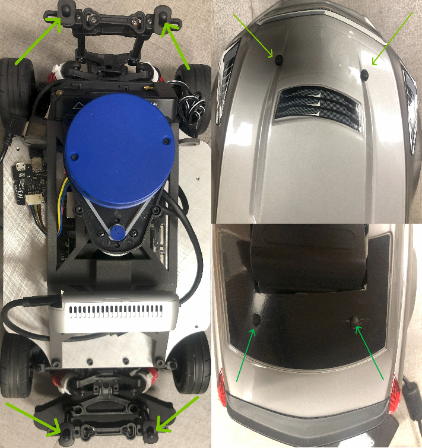 |

# Wiring (Power) Connection Sequence

# 

| Step 1: Remove the shell from the chassis. | 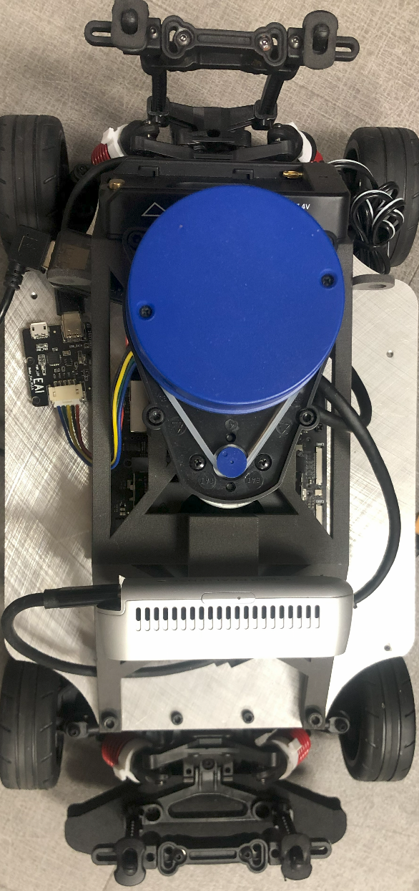 |
|----|----|
| Step 2: Connect the powerbank and its dc barrel connector to the jetson | 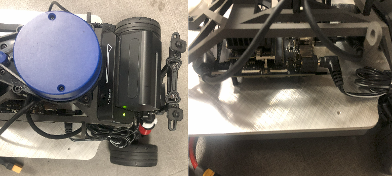 |
| Step 3: Place the battery on the chassis | 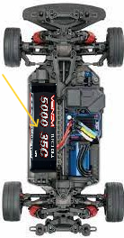 |
| Step 4: Connect the VESC to the battery using the XT-90 connectors | 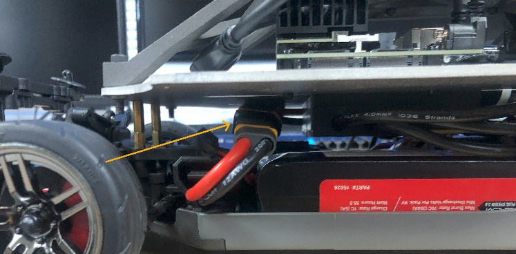 |
| Step 5 (optional): Attach the shell to the chassis |  |

<figure>
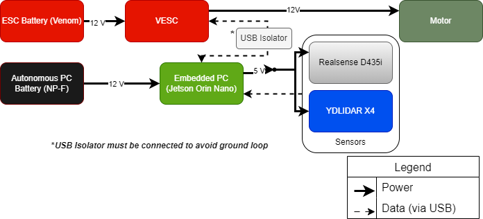
<figcaption>
: Wiring
</figcaption>
</figure>

# Network Configuration

| **Computer Name** | **Network Hostname** | **IP Address** | **Network Interface** | **RustDesk ID(Password)** |
|----|----|----|----|----|
| *Remote PC*: Linux Workstation | \<remote PC hostname\> | 192.168.2.xxx | WiFi: \<WiFi name\> | \<rustdesk ID\> : \<rustdesk password\> |
| *F1/10***:** car1 | \<car1 hostname\> | 192.168.2.xxx | WiFi: \<WiFi name\> | \<rustdesk ID\> : \<rustdesk password\> |

## Network Connection Steps:

1.  (optional: for visualization purposes or multi-machine ROS2 communication) Remote PC:

    1.  Connect the Remote PC to the WiFi and enter the password (UVS_wifi)

    2.  Install RustDesk

    3.  Setup a permanent password in the RustDesk settings

    4.  Open RustDesk

    5.  Enter the RustDesk credentials for the F1/10 in the table above

2.  On any F1/10

    1.  Connect the F1/10 to the WiFi and enter the password.

    2.  Install RustDesk

    3.  Setup a permanent password in the RustDesk settings

# DualSense\* Controller Setup

<table>
<colgroup>
<col style="width: 53%" />
<col style="width: 46%" />
</colgroup>
<thead>
<tr>
<th>

Figure 20: DualSense Controller (Front)

<em>Source : <a href="https://controller.dl.playstation.net/controller/lang/en/2100002.html">https://controller.dl.playstation.net/controller/lang/en/2100002.html</a></em>
</th>
<th><ol type="A">
<li>
Directional Buttons
</li>
<li>
Create/Share button
</li>
<li>
Light bar
</li>
<li>
Touch pad/button
</li>
<li>
Player Indicator
</li>
<li>
Options button
</li>
<li>
Action buttons
</li>
<li>
Right stick/R3
</li>
<li>
Speaker
</li>
<li>
PS Button
</li>
<li>
Headset Jack
</li>
<li>
Microphone
</li>
<li>
Mute button
</li>
<li>
Left stick/L3
</li>
</ol></th>
</tr>
</thead>
<tbody>
<tr>
<td>

: Dualsense Controller (Top)

<em>Source: <a href="https://controller.dl.playstation.net/controller/lang/en/2100002.html">https://controller.dl.playstation.net/controller/lang/en/2100002.html</a></em>
</td>
<td><ol type="A">
<li>
R1 button
</li>
<li>
R2 button
</li>
<li>
USB port
</li>
<li>
L1 Button
</li>
<li>
L2 Button
</li>
</ol></td>
</tr>
</tbody>
</table>

\* *Other controllers tested with the exact configuration and performance: DualShock 4, Logitech F710*

## Pairing Instructions:

1.  Press and hold the PS button (J) and the Create/Share (B) button at the same time until the Light Bar (C) blinks continuously.

2.  Connect to the Jetson via RustDesk as detailed above

3.  Open Bluetooth settings and connect to the DualSense Wireless Controller

4.  The light bar (C) and Player Indicator (E) should remain solid when paired.

<figure>
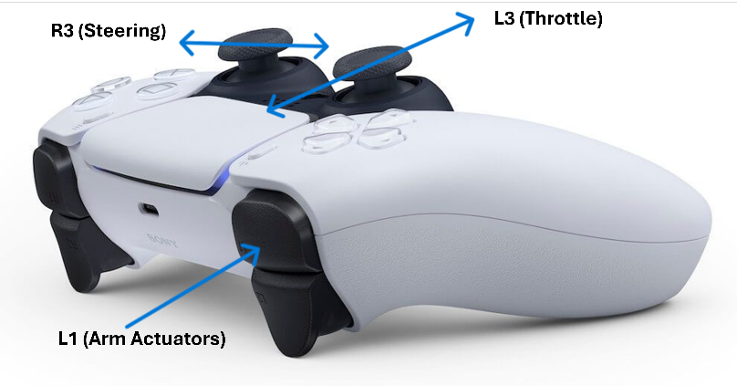
<figcaption>
: Control Scheme
</figcaption>
</figure>

# Software Setup

1.  Install ROS 2 Humble: Follow the official installation instructions [found here](https://docs.ros.org/en/humble/Installation/Ubuntu-Install-Debs.html).

2.  Configure the environment:

<table>
<colgroup>
<col style="width: 29%" />
<col style="width: 70%" />
</colgroup>
<thead>
<tr>
<th><ul>
<li>
Automatically load the path to ROS2 packages when a new terminal is opened.
</li>
</ul></th>
<th><ul>
<li>
echo "source /opt/ros/humble/setup.bash" &gt;&gt; ~/.bashrc
</li>
</ul></th>
</tr>
</thead>
<tbody>
<tr>
<td><ul>
<li>
Set CYCLONE_DDS as the default RMW implementation
</li>
</ul></td>
<td><ol type="1">
<li>
sudo apt update &amp;&amp; sudo apt install ros-${ROS_DISTRO}-rmw-cyclonedds-cpp
</li>
<li>
echo "export RMW_IMPLEMENTATION=rmw_fastrtps_cpp" &gt;&gt; ~/.bashrc
</li>
</ol></td>
</tr>
<tr>
<td><ul>
<li>
Create the ros2_ws
</li>
</ul></td>
<td><ul>
<li>
mkdir -p ~/ros2_ws/src &amp;&amp; colcon build –symlink-install
</li>
</ul></td>
</tr>
</tbody>
</table>

3.  Clone the necessary packages (listed in Software Requirements section above) to the ros2_ws and recompile.

## Launch Teleoperation Nodes (For a detailed and comprehensive explanation of every launch argument, check the comments in the launch file [**here**](https://github.com/privvyledge/f1tenth_launch/blob/humble-dev/launch/teleop.launch.py).)

1.  Launch the teleop nodes with the following commands: ros2 launch f1tenth_launch teleop.launch.py launch_vehicle:=True launch_sensors:=False launch_localization:=False vesc_poll_rate:=50.0.

2.  Nodes launched:

<table>
<colgroup>
<col style="width: 50%" />
<col style="width: 49%" />
</colgroup>
<thead>
<tr>
<th><ul>
<li>
VESC ROS Driver
</li>
</ul></th>
<th><ul>
<li>
Steering
</li>
<li>
Motor
</li>
<li>
IMU
</li>
</ul></th>
</tr>
</thead>
<tbody>
<tr>
<td><ul>
<li>
Joystick Driver (DualSense)
</li>
</ul></td>
<td><ul>
<li>
Publishes joystick inputs as ROS messages
</li>
</ul></td>
</tr>
<tr>
<td><ul>
<li>
Joy to Ackermann Node
</li>
</ul></td>
<td><ul>
<li>
Converts joystick messages to car speed and steering commands.
</li>
</ul></td>
</tr>
<tr>
<td><ul>
<li>
Ackermann to VESC node
</li>
</ul></td>
<td><ul>
<li>
Converts longitudinal speed and steering commands to motor RPM and steering PWM commands.
</li>
</ul></td>
</tr>
<tr>
<td><ul>
<li>
VESC to Ackermann node
</li>
</ul></td>
<td><ul>
<li>
Publishes kinematic wheel odometry node
</li>
</ul></td>
</tr>
</tbody>
</table>

3.  Parameters:

<table>
<colgroup>
<col style="width: 50%" />
<col style="width: 49%" />
</colgroup>
<thead>
<tr>
<th><ul>
<li>
launch_vehicle
</li>
</ul></th>
<th><ul>
<li>
Whether to turn on the VESC. Useful for testing only sensors or replaying recorded data.
</li>
</ul></th>
</tr>
</thead>
<tbody>
<tr>
<td><ul>
<li>
vesc_poll_rate
</li>
</ul></td>
<td><ul>
<li>
Rate at which to communicate with the VESC to send commands and receive feedback. Higher frequencies lead to more sensor noise.
</li>
</ul></td>
</tr>
<tr>
<td><ul>
<li>
launch_sensors
</li>
</ul></td>
<td><ul>
<li>
Whether to turn on all sensors.
</li>
</ul></td>
</tr>
<tr>
<td><ul>
<li>
launch_localization
</li>
</ul></td>
<td><ul>
<li>
Whether to launch local and global localization nodes.
</li>
</ul></td>
</tr>
</tbody>
</table>

## Driving instructions:

1.  Hold down the L1 button to arm the motors (Note: the car will not move if L1 is released)

2.  Move the left analog stick up and down to drive/reverse. (Note: move slowly otherwise the car will accelerate rapidly).

3.  Move the right analog stick left and right to steer the car

*NOTES: The provided scripts launch visualization and sensor compression/decompression nodes as well as enabling sensors.*

# Battery Management

#### LiPo Batteries (e.g Venom 3S LiPo)

1.  Keep the batteries at storage voltage of 11.3v when not in use.

2.  Charge the battery using the Traxxas EZ Peak Plus Dual Charger in advance mode. See official instructions [here](https://traxxas.com/sites/default/files/HKC18030-R05_2972X-TraxxasID-Dual%20Charger-INST-EN.pdf) (page 3).

3.  The VESC prevents the battery from being drained below safe voltages as well as configurable max charge/discharge current limits.

#### DualSense Battery: 

1.  The device includes an in-built Battery Management System which includes under-voltage and over-voltage protection.

2.  The device automatically shuts off when the battery is low.

3.  Recharge via USB.

#### NP-F Battery:

1.  The NP-F battery adapter prevents the battery from being drained below safe voltages.

2.  Charge via the NP-F chargers shown above.

# Operating Procedures

## Pre-operation checklist

1.  Inspect the batteries

2.  Charge the batteries (ESC, PC and controller) to full voltage.

3.  Ensure all cables are connected and there are no shorts.

## Startup sequence: 

### Power-up sequence

1.  Connect the DC jack to the Jetson to turn it on.

2.  Connect the sensors to the jetson.

3.  Connect the LiPo battery to the VESC.

4.  Connect the micro-USB from the VESC to the USB isolator

5.  Connect the USB isolator to the Jetson

6.  Connect the sensors to the Jetson via USB

### Connection establishment

1.  The jetsons power status LED should be solid green.

2.  The VESCs status LED should be solid red.

3.  The USB isolators LED should be solid red.

### Normal Operation Procedures:

- Actuators (steering and throttle) should respond when armed.

- The LIDAR should start spinning (if sensors are activated).

### Shutdown sequence

1.  Press CTRL-C on the terminal used to launch the nodes to cancel all running nodes (this could take about 4 seconds to safely shutdown the actuators and sensors).

2.  Shut down the PC: sudo shutdown now.

3.  Disconnect all batteries, especially the VESC.

### Emergency procedures

1.  Elevate the car off the ground.

2.  Disconnect the VESC from the battery.

3.  Unplug the DC barrel jack from the Jetson.

# Troubleshooting Guide

**Network Connectivity Issues**

<table>
<colgroup>
<col style="width: 50%" />
<col style="width: 50%" />
</colgroup>
<thead>
<tr>
<th><strong>Issue</strong></th>
<th><strong>Solution</strong></th>
</tr>
</thead>
<tbody>
<tr>
<td><ul>
<li>
ROS topics not visible across machines
</li>
</ul></td>
<td><ul>
<li>
Make sure both machines are connected to the same network (not necessary for RustDesk)
</li>
<li>
Ping the IP address of machine B from machine A, i.e “ping 192.168.2.194” from Remote PC
</li>
<li>
Ensure the terminal environment variable $ROS_LOCALHOST_ONLY=0
</li>
<li>
Ensure the terminal environment variable $ROS_DOMAIN_ID is either unset on both machines or equal
</li>
</ul></td>
</tr>
<tr>
<td><ul>
<li>
ROS topic rates too low on remote PC
</li>
</ul></td>
<td><ul>
<li>
For high bandwidth messages like PointClouds or images, use compressed messages as detailed below.
</li>
<li>
Reduce the number of devices connected to the WiFi router
</li>
<li>
Make sure the devices are within the range of the WiFi router
</li>
</ul></td>
</tr>
<tr>
<td><ul>
<li>
RustDesk (or SSH) disconnects
</li>
</ul></td>
<td><ul>
<li>
Occurs when CPU utilization is at 100% which usually occurs if Rviz is running on the Jetson while running teleoperation with sensing and other nodes. Run Rviz on the remote PC instead.
</li>
</ul></td>
</tr>
</tbody>
</table>

**Controller Connectivity Issues**

<table>
<colgroup>
<col style="width: 37%" />
<col style="width: 36%" />
<col style="width: 26%" />
</colgroup>
<thead>
<tr>
<th><strong>Issue</strong></th>
<th><strong>Explanation</strong></th>
<th><strong>Solution</strong></th>
</tr>
</thead>
<tbody>
<tr>
<td><ul>
<li>
Controller keeps disconnecting (or does not connect)
</li>
</ul></td>
<td><ul>
<li>
Due to the cheap Network Interface Card included in the Jetson, WiFi and Bluetooth connections can be unstable.
</li>
</ul></td>
<td><ul>
<li>
For now, the only solution is to retry until successful.
</li>
<li>
(Future) replace with better NIC or adapters.
</li>
</ul></td>
</tr>
</tbody>
</table>

**Power Issues**

<table>
<colgroup>
<col style="width: 35%" />
<col style="width: 39%" />
<col style="width: 25%" />
</colgroup>
<thead>
<tr>
<th><strong>Issue</strong></th>
<th><strong>Explanation</strong></th>
<th><strong>Solution</strong></th>
</tr>
</thead>
<tbody>
<tr>
<td><ul>
<li>
LiPo Battery connected to VESC drained below safe voltage.
</li>
</ul></td>
<td><ul>
<li>
Due to hardware/software bugs in the VESC 6 VI, the auto-disconnect function does not work and the VESC keeps draining the battery (although at low rates).
</li>
</ul></td>
<td><ul>
<li>
Disconnect the battery from the VESC after each use.
</li>
<li>
Use a Power Distribution Unit.
</li>
<li>
Upgrade to VESC 6 HP.
</li>
</ul></td>
</tr>
<tr>
<td><ul>
<li>
Jetson node rates lower than expected.
</li>
</ul></td>
<td><ul>
<li>
Due to the limited power output of the NP-F battery and adapter which is incapable of supplying more than half the power required by the Jetson, the Jetsons performance is throttled.
</li>
</ul></td>
<td><ul>
<li>
(Future) replace the NP-F components with a Power Distribution Unit capable of supplying the required power.
</li>
</ul></td>
</tr>
<tr>
<td><ul>
<li>
RealSense or LIDAR fails to connect.
</li>
</ul></td>
<td><ul>
<li>
Due to the limited output of the Jetsons single USB controller, starting up all sensors at once leads to current limits which temporarily disables some of the USB outputs.
</li>
</ul></td>
<td><ul>
<li>
Software delay is used to startup the sensors sequentially.
</li>
<li>
Add a powered USB hub.
</li>
</ul></td>
</tr>
</tbody>
</table>
